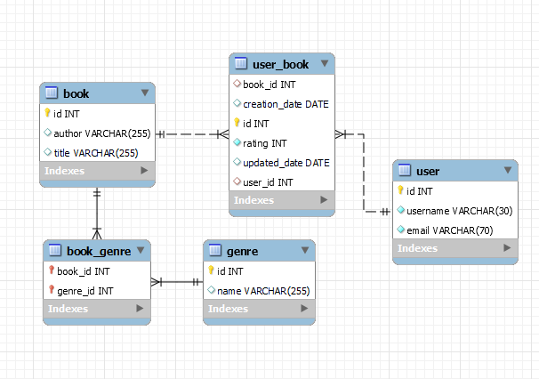

# REST API BookStore

### REST API built in Java with Spring Boot and Maven.

**Technologies used:**

 - Java 17 
 - SpringBoot
 - Maven
 - MySQL
 - Postman

**Database Diagram**


**Project Structure:**
├── src
│ ├── main
│ │ ├── java
│ │ │ └── com.bookstore.bookstoreapi
│ │ │ │├── controllers **Contains REST controller classes** 
│ │ │ │├── dtos **Contains DTO classes for transferring data between layers of the application.**
│ │ │ │├── entities **Contains entity classes representing database tables**
│ │ │ │├── repositories **Contains Spring Data repositories for database access**
│ │ │ │└── services **Contains Interfaces for service classes**
│ │ │ ││└── implementation **Contains service classes for business logic**

**Endpoints:**
Book Class:
-   **GET api/v1/books:** Retrieves all books.
-   **GET api/v1/books/{id}:** Retrieves a book by its ID.
-   **GET api/v1/books/author/{author}:** Retrieves all books by an author name.
-   **GET api/v1/books/genre/{id}:** Retrieves all books by a genre ID.
-   **GET api/v1/books/user/{id}:** Retrieves all books added by a user by a their ID.
-   **POST api/v1/books:** Creates a new book.
-   **PUT api/v1/books:** Updates an existing book. (Requires sending the book's ID)
-   **DELETE api/v1/books/{id}:** Deletes a book by its ID.

Genre Class:
-   **GET api/v1/genres:** Retrieves all genres.
-   **GET api/v1/genres/{id}:** Retrieves a genre by its ID.
-   **POST api/v1/genres:** Creates a new genre.
-   **PUT api/v1/genres:** Updates an existing genre. (Requires sending the genre's ID)
-   **DELETE api/v1/genres/{id}:** Deletes a genre by its ID.

User Class:
-   **GET api/v1/users:** Retrieves all users.
-   **GET api/v1/users/{id}:** Retrieves a user by their ID.
-   **GET api/v1/users/{id}/books:** Retrieves all users which added a book by a book ID.
-   **POST api/v1/users:** Creates a new user.
-   **PUT api/v1/users:** Updates an existing user. (Requires sending the user's ID)
-   **DELETE api/v1/users/{id}:** Deletes a user by their ID.

UserBook Class:
-   **GET api/v1/userbooks:** Retrieves all user book records.
-   **GET api/v1/userbooks/{id}:** Retrieves a user book record by its ID.
-   **GET api/v1/userbooks/{userid}/{bookid}** Retrieves a user book record by its user ID and book ID.
-   **POST api/v1/userbooks:** Creates a new user book record.
-   **PUT api/v1/userbooks** Updates an existing user book record. (Requires sending the user book record's ID)
-   **DELETE api/v1/userbooks/{id}:** Deletes a user book record by its ID.
-   **DELETE api/v1/userbooks/{userid}/{bookid}:** Deletes a user book record by its user ID and book ID.

**Examples:**
Get User books by ID:


Get Books by Genre ID:


Get Books By Author name:


**Additional Information:**
The `application.properties` file is omitted from the repository for security reasons. Instead, you'll find an `application.properties.example.txt` file. After cloning the project, please rename this file to `application.properties` and fill in the missing information such as the Database URL, Username, and Password.
When making POST and PUT requests, ensure that the request body follows the structure of the respective Data Transfer Object (DTO). For example:
- The raw body of a POST request to create a new book should follow this format:
```json { "title": "The Way Of Kings", "author": "Brandon Sanderson", "genreNames": ["Fantasy", "Fiction"] } ```
(In this case, "genreNames" can also be a list of genre IDs.)
